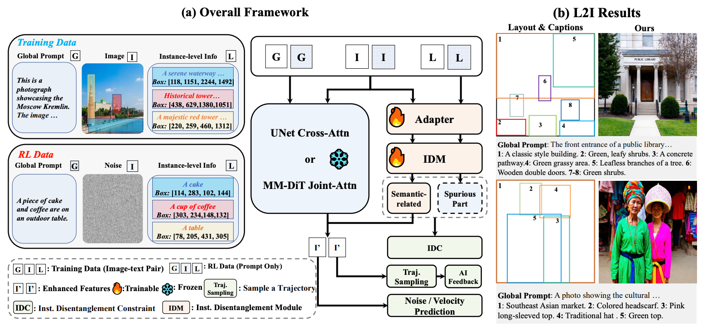

# [ICLR 2026] I-DRUID: Layout to image generation via instance-disentangled representation and unpaired data

## Introduction

I-DRUID, a generalized L2I model through on-policy RL with disentangled features.



## Quick Start

### Setup

#### (1) Download VLMs and Benchmarks


**VLMs and benchmarks used in this repo:**
| Link | Name | Description  |
| ------------------------------------------------------------------------------------------------ | -------------- | -------------------------------------------------------------------------------------------------------- |
| <a href=" ">< img src="https://img.shields.io/badge/🤗_HuggingFace-Model-ffbd45.svg" alt="HuggingFace"></a > | SD3-mid | SD3 base Model 
| <a href="https://huggingface.co/FlyingRoastDuck/I_DRUID">< img src="https://img.shields.io/badge/🤗_HuggingFace-Model-ffbd45.svg" alt="HuggingFace"></a > | I-DRUID | Our Pretrained Model 
| <a href="https://huggingface.co/openbmb/MiniCPM-V-2_6">< img src="https://img.shields.io/badge/🤗_HuggingFace-Model-ffbd45.svg" alt="HuggingFace"></a > | MINI-CPM | MINI-CPM for evaluation
| <a href="https://github.com/idea-research/groundingdino">< img src="https://img.shields.io/badge/🤗_HuggingFace-Model-ffbd45.svg" alt="HuggingFace"></a > | GDINO | Reward Model
| <a href="https://huggingface.co/datasets/HuiZhang0812/LayoutSAM-eval">< img src="https://img.shields.io/badge/🤗_HuggingFace-Benchmark-ffbd45.svg" alt="HuggingFace"></a > | LayoutSAM-eval | Benchmark for Evaluation
| <a href="https://huggingface.co/datasets/HuiZhang0812/LayoutSAM">< img src="https://img.shields.io/badge/🤗_HuggingFace-Benchmark-ffbd45.svg" alt="HuggingFace"></a > | LayoutSAM | One of our Training Data
| <a href="https://github.com/LeyRio/MIG_Bench">< img src="https://img.shields.io/badge/🤗_HuggingFace-Benchmark-ffbd45.svg" alt="HuggingFace"></a > | COCO-MIG | Benchmark for Evaluation


**Note:**
- For GDINO, please follow their instruction for setup. 
- COCO-MIG's testing prompts have been fused in this repo, however, you can prepare new testing prompts with their scripts.

#### (2) Preparing Environment

```
conda create --name druid python=3.8 -y
conda activate druid
pip install -r requirements.txt
```

#### (3) Inferening Images and Evaluation

**For COCO-MIG**

- Adjusting corresponding VLM paths in eva_coco.sh
- Uncomment "eva on LayoutSAM-eval" and run:
```
bash eva_coco.sh
```
The default number of GPUs used for inference is 8. please adjust accordingly. You should at least use NVIDIA V100 (32 G) at this step. Note that, you should adjust "lora_path" and "SD3_PATH" to I-DRUID and SD3-mid paths. The default path for saving of inferred images is './outputs/DRUID_LayoutRL/images', you can adjust by modifying "SAVE_COCO_ROOT".

- Adjusting "IMG_RL_DIR" (the default should be "./outputs/DRUID_LayoutRL/images") in score_cocomig.sh and run evaluation to obtain L2-L6 of ISR and mIoU. Note that GDINO is required in this step.

**For LayoutSAM-eval**

- The whole process is similar to COCO-MIG. Please Uncomment "eva on COCO-MIG" and run:
```
bash eva_coco.sh
```
You should adjust "MINICPM", "SAVE_ROOT", and "LAYOUTSAM_EVAL_PATH" accordingly. The script will automatically compute corresponding evaluation metrics.


## Citation & Acknowledgement

This repo borrows partially from COCO-MIG and Creati-Layout, if you find our research useful please consider citing:
```latex
@article{zhang2024creatilayout,
  title={CreatiLayout: Siamese Multimodal Diffusion Transformer for Creative Layout-to-Image Generation},
  author={Zhang, Hui and Hong, Dexiang and Gao, Tingwei and Wang, Yitong and Shao, Jie and Wu, Xinglong and Wu, Zuxuan and Jiang, Yu-Gang},
  journal={arXiv preprint arXiv:2412.03859},
  year={2024}
}
@inproceedings{zhou2024migc,
  title={Migc: Multi-instance generation controller for text-to-image synthesis},
  author={Zhou, Dewei and Li, You and Ma, Fan and Zhang, Xiaoting and Yang, Yi},
  booktitle={Proceedings of the IEEE/CVF Conference on Computer Vision and Pattern Recognition},
  pages={6818--6828},
  year={2024}
}
@inproceedings{yang2026druid,
    author={Yang Fengxiang and Zheng Tianyi and Yin Bangjie and Liu Shice and Chen Jinwei and Jiang Pengtao and Li Bo},
    title={I-DRUID: Layout to image generation via instance-disentangled representation and unpaired data},
    booktitle={ICLR},
    year={2026},
}
```
